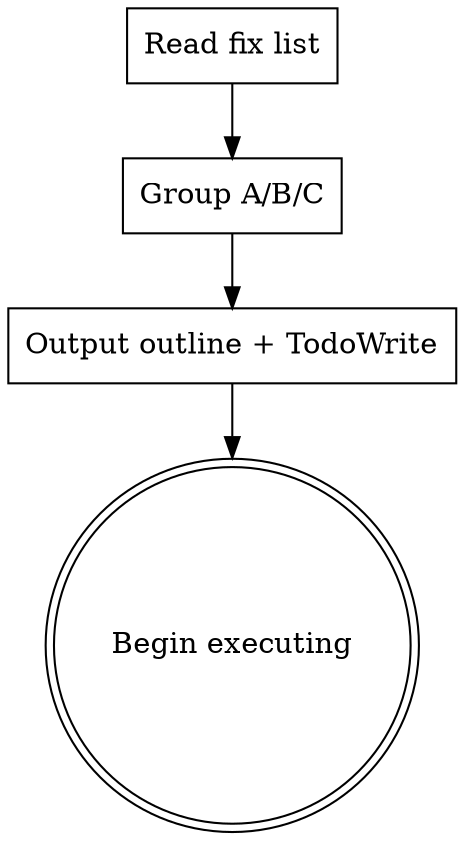

# Autonomous Fix-List Execution

## When this fires

Trigger phrases (any one is sufficient):

- "full autonomy" / "FULL autonomy"
- "every permission is granted" / "permission granted"
- "don't come back and ask" / "don't ask"
- "just use subagents to run everything"
- "stay within our parameters of our fixes"
- "minimal input from my end" / "very minimal input"

Plus: any prompt that hands a numbered or bulleted fix list and signals he doesn't want to be interrupted.

When it fires, also invoke `autonomous-execution` for the decision-gating policy. The two compose: **autonomous-execution** tells you when to interrupt; **this skill** tells you how to run the workflow.

## Pre-flight

1. Confirm trigger phrase is present (or implied by tone). If genuinely ambiguous, do NOT invoke this skill — fall back to normal behavior. False positives here are worse than false negatives.
2. Read his fix list end-to-end. Note items that are clearly OUT of scope (Phase 3+ work, schema redesigns, things he explicitly deferred). You will exclude those without asking.
3. Check `git status` and the current branch. Confirm you're on the right working branch (usually a feature branch, not main).

## The workflow

### Step 1 — Plan in one message

Output a single response that contains:

- **Phase grouping.** Group his items into:
  - Phase A — functional bugs / blocked flows (highest priority)
  - Phase B — UI / polish / restructure work
  - Phase C — verification + ship
- **Step-by-step outline.** One bullet per concrete step. Each step should be small enough that a single subagent can execute it.
- **Out-of-scope callout.** Explicitly list what you're NOT doing (Phase 3 work, redesigns beyond his ask, etc.). Stays surgical.
- **TaskCreate entries.** One task per step. Don't be shy — granular tasks are good.
- A single sentence: "Starting now." Then immediately begin executing. Don't wait for confirmation.



### Step 2 — Dispatch subagents

For each task, decide one of three execution paths:

- **Inline as controller** (you do it): single-file edit, < 10 lines, obvious correct answer. Examples: a one-line SQL filter fix, a single-import swap, a one-character escape fix. Don't waste a subagent dispatch on these.
- **Single subagent dispatch** (general-purpose, sometimes haiku model for mechanical work): the standard path. Most tasks land here.
- **Parallel subagent dispatch** (multiple Agent tool calls in one message): when 2+ tasks touch independent files with no shared mutable state. Common: schema-fix + UI-inventory in parallel, since they don't conflict.

#### Subagent prompt shape (worked well in the 2026-04-25 session)

Each implementer prompt should include in this order:

1. **Project context** — repo path, branch, recent commits, stack version (Next.js / Python / Supabase project id)
2. **Task description** — verbatim where the spec is exact (paste code blocks). Reference plan/spec files when relevant.
3. **Files to read first** — explicit paths the subagent should grep/read before editing
4. **Files to modify** — explicit paths
5. **Verification steps** — `npx tsc --noEmit`, `pytest`, visual via Chrome DevTools MCP if UI
6. **Exact commit command + message** — pre-write the commit message; subagent shouldn't be improvising messages
7. **Autonomy clause**: "Don't ask. Don't push. Don't touch `.claude/hooks/verify-before-stop.sh`. If you find an unrelated bug, flag in the report but don't fix unless it's a one-line fix that's clearly safe."
8. **Report format**: status / commit SHA / files changed / verification results / deviations from spec / concerns

### Step 3 — Catch issues during the work

When a subagent's report flags concerns:

- **One-line fix in a single file** → patch inline as controller. Don't dispatch another subagent.
- **Unrelated regression discovered while doing the task** (e.g. another sync-API gotcha, missing filter on a query) → fix inline if clearly safe, otherwise flag in the final report and either dispatch a follow-up subagent or note as a "next session" item.
- **Spec-bug in your own plan** (the verbatim code you wrote into the plan was wrong) → patch the plan, dispatch a fix subagent, note in the report.

### Step 4 — Final controller verification pass

Before pushing:

```
cd "/Users/simon/OS/Living VAULT/Content OS/The Hub"
npx tsc --noEmit  # exit 0
cd scripts && python3 -m pytest tests -q  # baseline-or-higher passes
```

Then walk every changed route via Chrome DevTools MCP:
- Take a fullPage screenshot of each
- Confirm zero console errors except known IG-CDN avatar `NotSameOrigin` blocks (the gradient fallback handles those)

If anything breaks, fix it (or dispatch a fix subagent) BEFORE pushing.

### Step 5 — Push

```
git push origin <branch>
```

If the branch already has an open PR, the head advances automatically — no PR action needed beyond noting the new head SHA.

### Step 6 — Final report

Output a single closing message containing:

- **Per-commit table** — one row per commit with SHA + one-sentence summary
- **Decisions taken** section — every autonomous call worth knowing about: icon-library fallbacks, soft-delete vs hard-delete, consolidation choices, inline vs subagent decisions on edge cases
- **Things to know for next session** — flagged follow-ups that didn't make this pass: intentional Phase 3 deferrals, minor polish, schema questions, anything Simon should be aware of without re-reading the diff

## Boundaries

These hold absolutely:

- **Don't expand scope.** If he said "fix X, Y, Z and the icons", don't also redesign the navigation. Stay surgical even when adjacent work is tempting.
- **Don't ask "do you want me to..." mid-execution.** The trigger means: pick the cleanest path within stated scope and execute. If a genuinely MAJOR decision fires per `autonomous-execution` (destructive action, security choice, cost overrun, etc.), THEN escalate — but only then.
- **Don't skip verification because the work feels small.** Always typecheck + pytest + visual + push.
- **Don't surface internal subagent reviews to the user** unless a MAJOR decision actually fires. They're internal quality gates, not status updates.
- **Don't push unfinished work.** If the final verification reveals a regression, fix before pushing.

## Composition with other skills

- **`autonomous-execution`** — invoke alongside this skill. It defines the decision-gating policy (when to escalate vs decide-and-report). This skill defines the workflow.
- **`superpowers:dispatching-parallel-agents`** — use when 2+ tasks are independent. Send multiple Agent tool calls in a single message.
- **`superpowers:subagent-driven-development`** — overlaps but different shape. SDD has explicit per-task review loops (spec-compliance + code-quality reviewer subagents). This skill compresses those into one combined review for verbatim/mechanical tasks, splits them for judgment-heavy ones.
- **`sync-project-state`** — invoke at the END of the session if architectural changes landed (new tables, RPCs, routes, dependencies). Propagates to vault docs.
- **`verify-and-fix`** — fold its checks into the Step 4 verification pass.

## What never to do under this trigger

- Ask Simon clarifying questions about scope, priorities, or naming. Pick the cleanest answer using project context (CLAUDE.md, PROJECT_STATE, prior commits, memory). Report your choice in the final summary.
- Use the `confirm` user-side dialog as a status update mechanism. The trigger is unambiguous; just execute.
- Hold a subagent's flagged concern indefinitely. Either patch it inline, dispatch a follow-up, or explicitly mark it as "next session" in the final report. No silent drops.
- Run more than 4 hours of work without a checkpoint commit. Even within the autonomous run, commit at logical boundaries so a session interruption doesn't lose work.

## Example — 2026-04-25 session

Simon's prompt (paraphrased): listed 4 problems with the creator detail page (retry RPC error, missing Add Account button, generic icons, page shaped like an Instagram page) + said "you have FULL autonomy to get this done... every permission is granted... dont come back and ask me for anything just use subagents to run everything."

Workflow that ran:

1. Posted Phase A/B/C outline + 8 TaskCreate entries
2. Dispatched A1 (RPC fix) and B1 (UI inventory) **in parallel** — independent tasks
3. Dispatched B2+B3 (brand icons + sort) sequentially after B1 returned
4. Dispatched A2+A3+A5+B4 (page restructure + Add Account + Remove + button consolidation) sequentially after B2/B3 returned
5. Patched **`getProfilesForCreator` is_active filter inline** as controller — subagent flagged it, single-line fix
6. Dispatched B5 (consistency propagation to /creators + /platforms) — found and fixed 3 more Next 16 sync-API regressions inline
7. Final controller verification: tsc 0, pytest 102/102, walked /creators/gothgirlnatalie via Chrome DevTools MCP, confirmed brand-HQ layout
8. Pushed. PR head advanced automatically.
9. Final report with 6-commit table + Decisions taken + Things-to-know

Total: 6 commits, ~90 minutes wall time, zero check-ins with Simon mid-execution.
